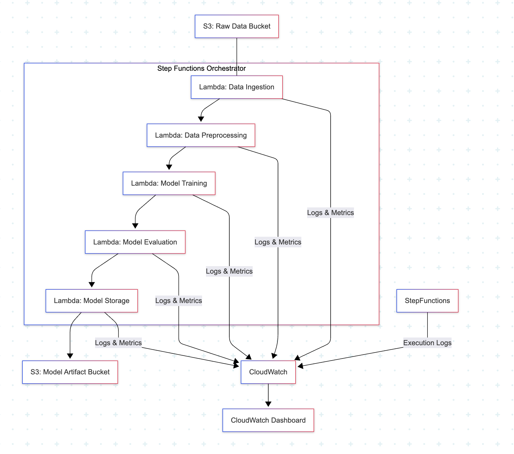

# AI Pipeline Orchestration 

## Overview

This project implements an orchestrated AI pipeline using **AWS Step Functions**, **Lambda**, and **CloudWatch**, designed to automate the ingestion, preprocessing, and sentiment analysis of textual data. The system features built-in **retries**, **error handling**, and **logging**, ensuring robustness and visibility throughout the ML pipeline lifecycle. The deployment of the lambda functions was done using **AWS SAM**, which handles any underlying layers and makes the process much easier. 

---

## Architecture

### High-Level Workflow


## State Machine Definition

The workflow is defined in Amazon States Language (ASL). Below is a simplified breakdown:

- **DataIngestion**: Fetches or receives raw data (e.g., tweets, reviews)
- **Preprocessing**: Cleans, tokenizes, and formats text for sentiment analysis
- **AnalyzeSentiment**: Invokes a model (or API) to predict sentiment
- **Success**: Indicates successful pipeline completion
- **Failure**: Centralized failure handler after retries are exhausted

## Project Structure 
```
AIOrchestration
├── images/                 # contains the diagram
├── src/
│   ├── upload_dataset.py           # script used to upload the dataset to S3
│   ├── data_ingestion                  # structure used by AWS SAM
│   │   └── data_ingestion.py            # lambda handler 
│   │   └── requirements.txt  
│   ├── preprocess_data
│   │   └── preprocess_data.py            # lambda handler 
│   │   └── requirements.txt  
│   └── sentiment_analysis
│   │   └── sentiment_analysis.py            # lambda handler 
│   │   └── requirements.txt  
├── ml_pipeline_step_function.json      # Step function definition
├── README.md
├── samconfig.toml                      # File generating after building with AWS SAM
├── template.yaml                       # AWS SAM template
└── .gitignore
```

## Monitoring & Logging
- All Lambda functions log events to Amazon CloudWatch Logs with a unique requestId.
- Logs include timestamps, status messages, and error traces.
- A CloudWatch Dashboard was created to visualize invocation counts, error counts and duration of executions

## Error Handling 
- Each state has:
    - Retry block for transient errors (up to 3 attempts)
    - Catch block that redirects to Failure if all retries fail
- These ensure the pipeline can handle:
    - Temporary network failures
    - Lambda timeouts
    - Unavailable external services


## AI Usage 
- Claude 4.0 was used to create the template.yaml and the sentiment_analysis.py
